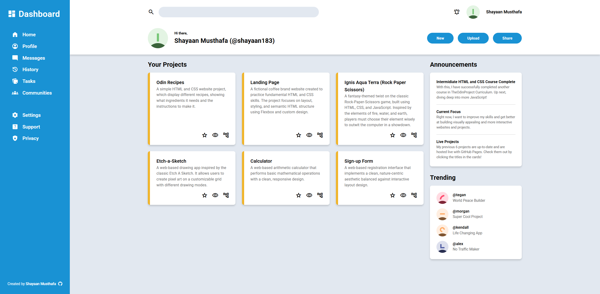

# Admin Dashboard

## About

A modern administrative dashboard page build as part of [The Odin Project Intermediate HTML and CSS Course](https://www.theodinproject.com/lessons/node-path-intermediate-html-and-css-admin-dashboard).

It serves as a centralized management hub for a developer's portfolio ecosystem. It leverages CSS's Grid layout architecture to display a user's profile, recent announcements, trending network updates, and a dedicated project registry showcasing previous applications.

*Note that this is a static layout and not a live backend dashboard system.*

## Preview

## Technologies Used

- HTML5
- CSS3
- Google Material Symbols (Iconography)

## Credits

- **Font Asset:** [Roboto via Google Fonts](https://fonts.google.com/)
- **Icon Assets:** [Material Symbols Outlined via Google Fonts](https://fonts.google.com/icons)
- **Avatar Vector Assets:** [Glyphs Library via DiceBear API](https://www.dicebear.com/)

## Contact

Created by [Shayaan Musthafa](https://github.com/shayaan183).